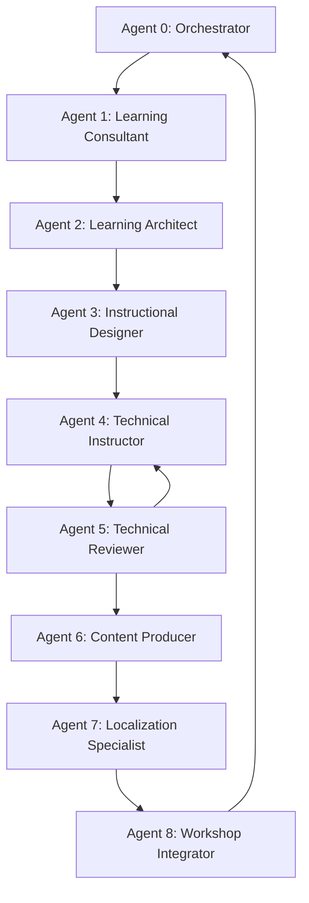

````chatagent
# Workshop Agent Orchestration Guide

---

## 📋 Overview

This document describes the automatic orchestration system for workshop agents (0–8), using **artifact presence** (not numeric prefixes) to track progress and determine the next step.

---

## 📁 File Organization Convention

### Two output locations:

| Location | Purpose | Examples |
|----------|---------|----------|
| **`.workshop/`** | Process logs, diagnostics, reviews, tracking | `DIAGNOSTIC.md`, `REVIEW-REPORT.md`, `LOCALIZATION-LOG.md` |
| **Project root** | Content deliverables (lessons, kits, guides) | `instructor-guide/`, `student-kit/`, lesson folders |

### Rules:
1. **No numeric prefixes** on any file or folder name
2. **Descriptive names only** (e.g., `WORKSHOP-MASTER-AGENDA.md` not `2-WORKSHOP-MASTER-AGENDA.md`)
3. **Lowercase folder names** with hyphens (e.g., `instructor-guide/`, `student-kit/`)
4. **UPPERCASE file names** for standalone documents (e.g., `CONTINGENCY-PLAN.md`)
5. **Localization**: translated files live alongside originals with language suffix: `FILENAME.pt-BR.md`

---

## 🎭 Agent 0: Project Lead (Orchestrator)

### Responsibility
Coordinate the workflow between all agents, invoking the next agent automatically based on existing artifacts.

### Orchestration Logic

```
┌─────────────────────────────────────────────────────────┐
│  Agent 0: Scan .workshop/ AND project root              │
└────────────────┬────────────────────────────────────────┘
                 │
                 v
┌─────────────────────────────────────────────────────────┐
│  Check for known artifacts from each agent              │
│  (see Artifact Mapping table below)                     │
└────────────────┬────────────────────────────────────────┘
                 │
                 v
┌─────────────────────────────────────────────────────────┐
│  Identify the last completed agent (1–7)                │
│  Next agent = last_completed + 1                        │
└────────────────┬────────────────────────────────────────┘
                 │
                 v
┌─────────────────────────────────────────────────────────┐
│  IF next <= 8 THEN invoke Agent [next]                  │
│  ELSE → cycle complete, ready for delivery              │
└─────────────────────────────────────────────────────────┘
```

### Detection Algorithm

```python
def determine_next_agent():
    # Check each agent's signature artifacts
    agent_complete = {
        1: exists(".workshop/DIAGNOSTIC.md"),
        2: exists("instructor-guide/WORKSHOP-MASTER-AGENDA.md") and exists(".workshop/MODULE-MAPS.md"),
        3: any(exists(f"instructor-guide/MODULE-{n}") for n in ["0","1","2","3","4"]),
        4: any(exists(f"lesson-{n}*/demos/") or exists(f"lesson-{n}*/labs/") for n in range(1, 9)),
        5: exists(".workshop/REVIEW-REPORT.md"),
        6: exists("student-kit/"),
        7: exists(".workshop/LOCALIZATION-LOG.md"),
        8: exists(".workshop/INTEGRATION-CHECKLIST.md"),
    }
    
    # Find the highest completed agent
    completed = [n for n, done in agent_complete.items() if done]
    
    if not completed:
        return 1  # Start with Learning Consultant
    
    last = max(completed)
    next_agent = last + 1
    
    if next_agent <= 8:
        return next_agent
    else:
        return "COMPLETE"
```

---

## 📊 Sequential Agent Flow

```
Start
  │
  v
┌────────────────────────────────────────────────────────┐
│ Agent 0: Project Lead                                  │
│ • Scan .workshop/ + project root                       │
│ • Determine current state                              │
│ • Invoke next agent                                    │
│ Outputs → .workshop/:                                  │
│   DELIVERY-PLAN.md, RACI-MATRIX.md,                    │
│   DEPENDENCY-MAP.md, RISK-REGISTER.md,                 │
│   STATUS-REPORT.md                                     │
└────────────────┬───────────────────────────────────────┘
                 │
                 v
┌────────────────────────────────────────────────────────┐
│ Agent 1: Learning Consultant                           │
│ Output → .workshop/: DIAGNOSTIC.md                     │
└────────────────┬───────────────────────────────────────┘
                 │
                 v
┌────────────────────────────────────────────────────────┐
│ Agent 2: Learning Architect                            │
│ Outputs → instructor-guide/:                           │
│   WORKSHOP-MASTER-AGENDA.md, INSTRUCTOR-GUIDE.md       │
│ Outputs → .workshop/:                                  │
│   MODULE-MAPS.md, ASSESSMENT-FRAMEWORK.md,             │
│   LESSON-ENHANCEMENTS.md                               │
└────────────────┬───────────────────────────────────────┘
                 │
                 v
┌────────────────────────────────────────────────────────┐
│ Agent 3: Instructional Designer                        │
│ Outputs → instructor-guide/:                           │
│   MODULE-*-SCRIPT.md files                             │
└────────────────┬───────────────────────────────────────┘
                 │
                 v
┌────────────────────────────────────────────────────────┐
│ Agent 4: Technical Instructor/SME                      │
│ Outputs → lesson folders:                              │
│   lesson-N/demos/                                      │
│   lesson-N/labs/                                       │
│   lesson-N/media/                                      │
│   lesson-N/solution/                                   │
│   TECHNICAL-VALIDATION-REPORT.md (root)                │
└────────────────┬───────────────────────────────────────┘
                 │
                 v
┌────────────────────────────────────────────────────────┐
│ Agent 5: Technical Reviewer                            │
│ Output → .workshop/: REVIEW-REPORT.md                  │
│ (may loop back to Agent 4 for fixes)                   │
└────────────────┬───────────────────────────────────────┘
                 │
                 v
┌────────────────────────────────────────────────────────┐
│ Agent 6: Content Producer                              │
│ Outputs → project root:                                │
│   student-kit/                                         │
│ Outputs → instructor-guide/:                           │
│   CONTINGENCY-PLAN.md, ROOM-READY-CHECKLIST.md         │
│ Output → .workshop/:                                   │
│   DISTRIBUTION-MANIFEST.md                             │
└────────────────┬───────────────────────────────────────┘
                 │
                 v
┌────────────────────────────────────────────────────────┐
│ Agent 7: Localization Specialist                       │
│ Outputs → alongside originals: *.pt-BR.md              │
│ Logs → .workshop/:                                     │
│   LOCALIZATION-LOG.md, GLOSSARY.md                     │
└────────────────┬───────────────────────────────────────┘
                 │
                 v
┌────────────────────────────────────────────────────────┐
│ Agent 8: Workshop Integrator                           │
│ Outputs → project root:                                │
│   README.md (updated with links to all deliverables)   │
│ Logs → .workshop/:                                     │
│   INTEGRATION-CHECKLIST.md                             │
└────────────────┬───────────────────────────────────────┘
                 │
                 v
              COMPLETE
    (Ready for delivery or next iteration)
```

---

## 🔢 Artifact Mapping

| Agent | Role | Signature Artifacts | Location |
|-------|------|---------------------|----------|
| **0** | Project Lead | `DELIVERY-PLAN.md`, `STATUS-REPORT.md` | `.workshop/` |
| **1** | Learning Consultant | `DIAGNOSTIC.md` | `.workshop/` |
| **2** | Learning Architect | `WORKSHOP-MASTER-AGENDA.md`, `INSTRUCTOR-GUIDE.md` | `instructor-guide/` |
| | | `MODULE-MAPS.md`, `ASSESSMENT-FRAMEWORK.md`, `LESSON-ENHANCEMENTS.md` | `.workshop/` |
| **3** | Instructional Designer | `MODULE-*-SCRIPT.md` files | `instructor-guide/` |
| **4** | Technical Instructor/SME | `lesson-N/demos/`, `lesson-N/labs/`, `lesson-N/media/`, `lesson-N/solution/` | Lesson folders |
| **5** | Technical Reviewer | `REVIEW-REPORT.md` | `.workshop/` |
| **6** | Content Producer | `student-kit/` (root), `CONTINGENCY-PLAN.md`, `ROOM-READY-CHECKLIST.md` | Project root + `instructor-guide/` |
| | | `DISTRIBUTION-MANIFEST.md` | `.workshop/` |
| **7** | Localization Specialist | `LOCALIZATION-LOG.md`, `GLOSSARY.md` + `*.pt-BR.md` files | `.workshop/` + alongside originals |
| **8** | Workshop Integrator | `README.md` (updated) | Project root |
| | | `INTEGRATION-CHECKLIST.md` | `.workshop/` |

---

## 📁 Target Directory Structure

```
project-root/
│
├── .github/agents/              # Agent definitions (unchanged)
│
├── .workshop/                   # Process logs, tracking, and planning docs
│   ├── DECISION-LOG-EXAMPLE.md
│   ├── DIAGNOSTIC.md
│   ├── REVIEW-REPORT.md
│   ├── ASSESSMENT-FRAMEWORK.md
│   ├── MODULE-MAPS.md
│   ├── LESSON-ENHANCEMENTS.md
│   ├── DISTRIBUTION-MANIFEST.md
│   ├── LOCALIZATION-LOG.md
│   ├── GLOSSARY.md
│   ├── INTEGRATION-CHECKLIST.md
│   └── ISSUES/                  # Optional issue reports
│
├── instructor-guide/                # All instructor-facing materials
│   ├── INSTRUCTOR-GUIDE.md          # Main facilitation guide
│   ├── WORKSHOP-MASTER-AGENDA.md    # Detailed 5-day agenda
│   ├── CONTINGENCY-PLAN.md          # Fallback strategies
│   ├── ROOM-READY-CHECKLIST.md      # Pre-session checklist
│   ├── MODULE-0-INFRASTRUCTURE-SCRIPT.md
│   ├── MODULE-1-DECLARATIVE-AGENT-SCRIPT.md
│   ├── MODULE-2-HOSTED-MAF-SCRIPT.md
│   ├── MODULE-3-HOSTED-LANGGRAPH-SCRIPT.md
│   ├── MODULE-4-ACA-DEPLOYMENT-SCRIPT.md
│   ├── MODULES-5-6-A365-SETUP-SDK-SCRIPT.md
│   └── MODULES-7-8-PUBLISH-INSTANCES-SCRIPT.md
│
├── TECHNICAL-VALIDATION-REPORT.md  # Technical validation summary
├── capability-host.md              # Capability Host reference
├── capability-host.pt-BR.md
│
├── student-kit/                    # Content Producer output
│   ├── SETUP-GUIDE.md
│   └── RESOURCES-LINKS.md
│
├── README.md                    # Original English
├── README.pt-BR.md              # pt-BR translation (alongside)
│
├── lesson-1-declarative/
│   ├── README.md
│   ├── README.pt-BR.md          # Translation alongside original
│   ├── demos/                   # Demo walkthroughs
│   ├── labs/                    # Lab exercises (starter + solution)
│   ├── media/                   # Architecture/deployment diagrams
│   └── solution/                # Runnable lesson code
├── lesson-2-hosted-maf/
├── lesson-3-hosted-langgraph/
├── lesson-4-aca-langgraph/
├── lesson-5-a365-prereq/
├── lesson-6-a365-sdk/
├── lesson-7-publish/
├── lesson-8-instances/
│
├── prereq/
└── test/
```

---

## 🔄 Agent Dependencies



**Note**: Arrow from A5 to A4 represents the feedback loop (technical review may require content adjustments).

---

## 🎯 Usage Scenarios

### Scenario 1: New Workshop
```
State: .workshop/ is empty, no content at root
Action: "No artifacts found. Invoking Agent 1 (Learning Consultant)"
```

### Scenario 2: Diagnostic Complete
```
State: .workshop/DIAGNOSTIC.md exists
Action: "Agent 1 complete. Invoking Agent 2 (Learning Architect)"
```

### Scenario 3: Architecture Complete
```
State: WORKSHOP-MASTER-AGENDA.md at root + .workshop/MODULE-MAPS.md + .workshop/ASSESSMENT-FRAMEWORK.md
Action: "Agent 2 complete. Invoking Agent 3 (Instructional Designer)"
```

### Scenario 4: Cycle Complete
```
State: .workshop/INTEGRATION-CHECKLIST.md exists + README.md updated with all links
Action: "All agents completed. Workshop ready for delivery!"
```

---

## 💡 Practical Commands for Agent 0

### PowerShell (Windows)
```powershell
# Check .workshop/ for logs
Get-ChildItem .workshop -Filter "*.md" | Select-Object Name

# Check root for content deliverables
$contentArtifacts = @(
    "instructor-guide\WORKSHOP-MASTER-AGENDA.md"
)
$contentArtifacts | ForEach-Object { 
    if (Test-Path $_) { "$_ → EXISTS" } else { "$_ → MISSING" }
}

# Check .workshop/ for planning artifacts
$workshopArtifacts = @(
    ".workshop\MODULE-MAPS.md",
    ".workshop\ASSESSMENT-FRAMEWORK.md",
    ".workshop\DISTRIBUTION-MANIFEST.md",
    ".workshop\INTEGRATION-CHECKLIST.md"
)
$workshopArtifacts | ForEach-Object { 
    if (Test-Path $_) { "$_ → EXISTS" } else { "$_ → MISSING" }
}

# Check content folders
@("instructor-guide", "student-kit") | ForEach-Object {
    if (Test-Path $_) { "$_/ → EXISTS" } else { "$_/ → MISSING" }
}

# Check lesson subfolders (demos, labs, media, solution)
Get-ChildItem -Directory -Filter "lesson-*" | ForEach-Object {
    $lesson = $_.Name
    @("demos", "labs", "media", "solution") | ForEach-Object {
        $path = "$lesson/$_"
        if (Test-Path $path) { "$path/ → EXISTS" } else { "$path/ → MISSING" }
    }
}

# Check for pt-BR translations
Get-ChildItem -Recurse -Filter "*.pt-BR.md" | Select-Object FullName
```

---

## ✅ Artifact Quality Checklist

Each artifact must:
- [ ] Have a descriptive name (no numeric prefixes)
- [ ] Be in the correct location (`.workshop/` for logs, root for content)
- [ ] Be a well-structured `.md` file or folder with content
- [ ] Reference inputs from the previous agent
- [ ] Specify what should be passed to the next agent

---

## 📝 Important Notes

1. **Idempotency**: Agents should be able to re-execute without duplicating artifacts
2. **Versioning**: If recreating artifacts, consider version suffix: `DIAGNOSTIC-v2.md`
3. **Feedback Loops**: Agent 5 (Reviewer) can generate work for Agent 4 (SME) — Agent 0 manages this
4. **Localization**: `.pt-BR.md` files are created by Agent 7 alongside each English original
5. **Migration**: If old prefixed files exist (e.g., `2-WORKSHOP-MASTER-AGENDA.md`), rename them to the new convention

---

**Version**: 2.0
**Date**: 2025
**Maintainer**: Agent 0 (Project Lead)
````
