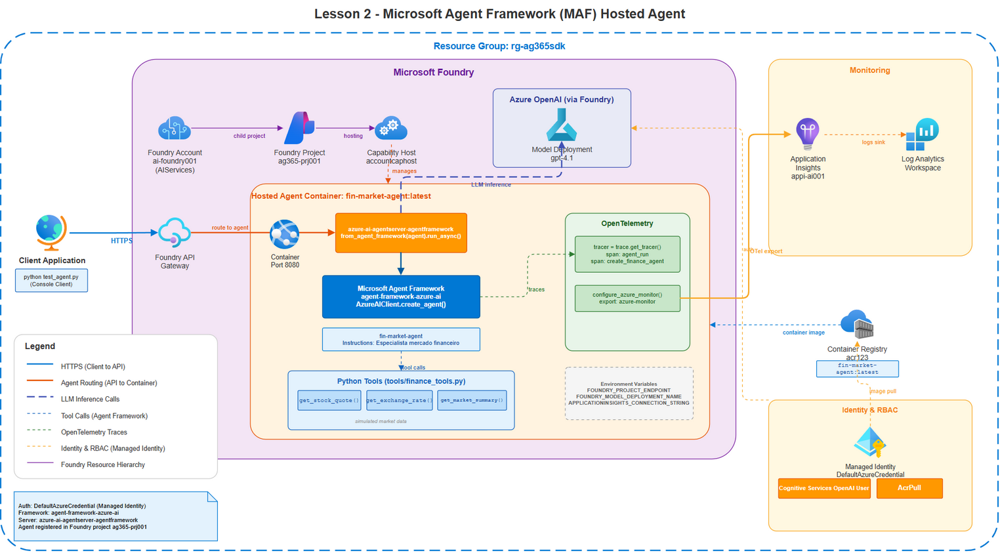
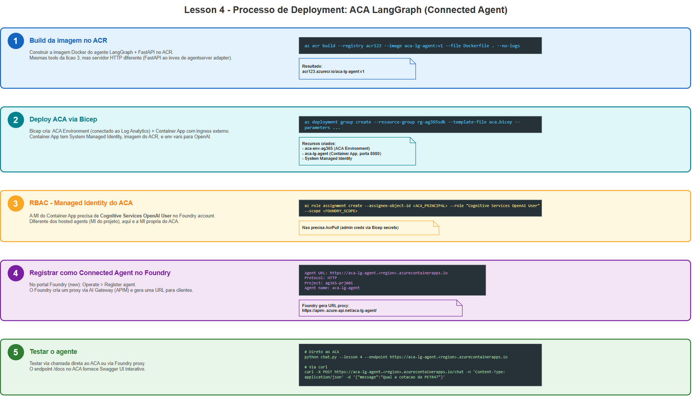

# Azure AI Foundry Agents Workshop

Workshop pratico para construir, implantar e gerenciar agentes de IA usando o **Microsoft Foundry** com diferentes abordagens: agentes declarativos, hosted agents (MAF e LangGraph), agentes em Azure Container Apps e integracao com Microsoft Agent 365.


## Conteudo

| Licao | Titulo | Abordagem | Descricao |
|:-----:|--------|-----------|-----------|
| [Prereq](prereq/) | Infraestrutura Azure | Bicep + az CLI | Provisiona Foundry, ACR, ACA Environment, App Insights |
| [1](lesson-1-declarative/) | Agente Declarativo | `PromptAgentDefinition` | Agente criado via SDK sem container, editavel no portal |
| [2](lesson-2-hosted-maf/) | Hosted Agent (MAF) | Microsoft Agent Framework | Container com MAF hospedado no Foundry |
| [3](lesson-3-hosted-langgraph/) | Hosted Agent (LangGraph) | LangGraph + adapter | Container LangGraph hospedado no Foundry |
| [4](lesson-4-aca-langgraph/) | Connected Agent (ACA) | FastAPI + LangGraph | Container proprio no ACA, registrado no Foundry Control Plane |
| [5](lesson-5-a365-prereq/) | Agent 365 (Prereqs) | A365 CLI | Preparacao para publicar agentes no Microsoft 365 |

## Pre-requisitos

- Azure CLI (`az`) instalado e autenticado
- Python 3.11+
- Docker (opcional, builds sao feitos no ACR)
- Subscription Azure com permissoes de Contributor

## Quick Start

```powershell
# 1. Provisionar infraestrutura
cd prereq
.\deploy.ps1

# 2. Deploy do agente declarativo (licao 1)
cd ../lesson-1-declarative
python create_agent.py

# 3. Deploy do hosted agent MAF (licao 2)
cd ../lesson-2-hosted-maf/foundry-agent
.\deploy.ps1

# 4. Deploy do hosted agent LangGraph (licao 3)
cd ../../lesson-3-hosted-langgraph/langgraph-agent
.\deploy.ps1

# 5. Deploy do agente no ACA (licao 4)
cd ../../lesson-4-aca-langgraph/aca-agent
.\deploy.ps1
```

## Testar os agentes

O script `test/chat.py` oferece uma interface unificada para conversar com qualquer agente:

```powershell
pip install azure-identity requests python-dotenv

# Declarativo
python test/chat.py --lesson 1 --endpoint https://<foundry>.services.ai.azure.com/api/projects/<project>

# Hosted MAF
python test/chat.py --lesson 2 --endpoint https://<foundry>.services.ai.azure.com/api/projects/<project>

# Hosted LangGraph
python test/chat.py --lesson 3 --endpoint https://<foundry>.services.ai.azure.com/api/projects/<project>

# ACA Connected (auto-resolve via az CLI)
python test/chat.py --lesson 4

# Query unica
python test/chat.py --lesson 1 --once "Qual a cotacao da PETR4?"
```

## Arquitetura

### Licao 1 - Agente Declarativo

Agente definido via `PromptAgentDefinition` e registrado no Foundry. Sem container, sem deploy. Instructions, model e tools sao editaveis diretamente no portal.


### Licao 2 - Hosted Agent (Microsoft Agent Framework)

Container Python com o Microsoft Agent Framework rodando dentro do Foundry como Hosted Agent. Usa o adapter `azure-ai-agentserver-agentframework` para expor a Responses API.



<details>
<summary>Fluxo de deploy</summary>


</details>

### Licao 3 - Hosted Agent (LangGraph)

Mesmo conceito do lesson 2, mas usando LangGraph como framework de orquestracao. O adapter `azure-ai-agentserver-langgraph` converte o grafo LangGraph em servidor HTTP compativel com a Responses API do Foundry.


<details>
<summary>Fluxo de deploy</summary>


</details>

### Licao 4 - Connected Agent (Azure Container Apps)

O agente LangGraph roda em infraestrutura propria (ACA) e e registrado como Connected Agent no Foundry Control Plane. O Foundry roteia requests via AI Gateway (APIM) para ganhar observabilidade e governanca.


<details>
<summary>Fluxo de deploy</summary>


</details>

### Licao 5 - Microsoft Agent 365 (Pre-requisitos)

Configuracao do A365 CLI, app registration no Entra ID e setup do Agent Blueprint para publicar agentes no Microsoft 365 (Teams, Outlook). Aborda o cenario cross-tenant (Azure != M365).

## Comparacao das abordagens

| Aspecto | Declarativo (L1) | Hosted MAF (L2) | Hosted LangGraph (L3) | ACA Connected (L4) |
|---------|:-:|:-:|:-:|:-:|
| Container Docker | Nao | Sim | Sim | Sim |
| Infra gerenciada pelo Foundry | Sim | Sim | Sim | Nao |
| Custom tools (Python) | Nao | Sim | Sim | Sim |
| Editavel no portal | Sim | Nao | Nao | Nao |
| Managed Identity | Projeto | Projeto | Projeto | ACA (propria) |
| Auto-scaling | N/A | Foundry | Foundry | ACA (configuravel) |
| Observabilidade via Foundry | Nativa | Nativa | Nativa | Via AI Gateway |
| Framework | SDK only | MAF | LangGraph | FastAPI + LangGraph |

## Estrutura do repositorio

```
foundry-agents-workshop/
  prereq/                          # IaC (Bicep) + scripts de infra
  lesson-1-declarative/            # Agente declarativo (SDK)
  lesson-2-hosted-maf/             # Hosted agent (Microsoft Agent Framework)
  lesson-3-hosted-langgraph/       # Hosted agent (LangGraph)
  lesson-4-aca-langgraph/          # Connected agent (ACA + FastAPI)
  lesson-5-a365-prereq/            # Pre-requisitos Agent 365
  test/
    chat.py                        # Cliente unificado para todos os agentes
  slides/
    *.drawio                       # Diagramas editaveis (draw.io)
    *.png                          # Diagramas exportados
  context.md                       # Diretrizes do workshop
```

## Tecnologias

- **Azure AI Foundry** - Plataforma de agentes (Responses API, Hosted Agents, Control Plane)
- **Microsoft Agent Framework** - Framework oficial para agentes no Foundry
- **LangGraph** - Framework de grafos para orquestracao de agentes (ReAct pattern)
- **Azure Container Apps** - Plataforma serverless para containers
- **Bicep** - Infrastructure as Code para Azure
- **Azure API Management** - AI Gateway para governanca e observabilidade
- **Microsoft Agent 365** - Publicacao de agentes no Microsoft 365

## Licenca

Este workshop e disponibilizado para fins educacionais.
