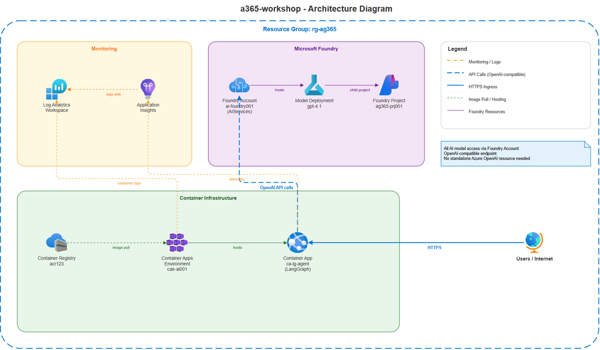
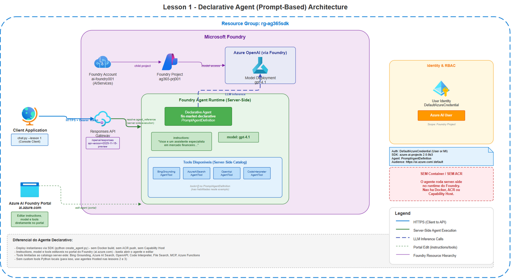
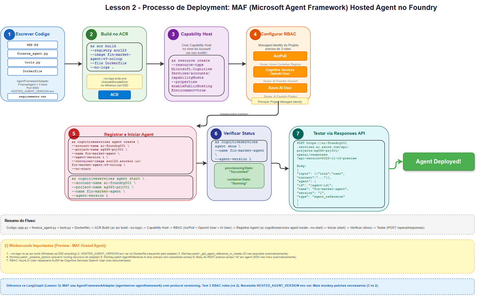
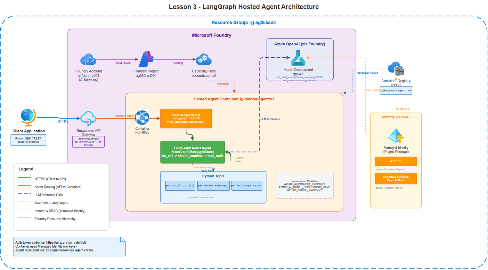
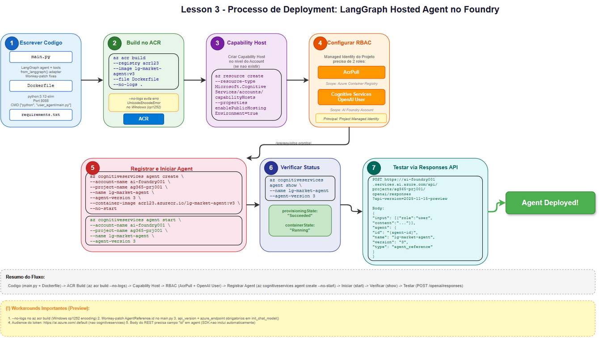
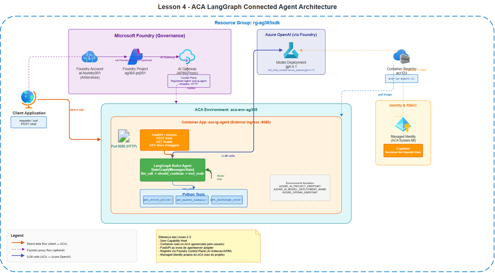

# Workshop de Agentes Microsoft Foundry

> 🇺🇸 **[Read in English](README.md)**

Workshop prático para construir, implantar e gerenciar agentes de IA usando o **Microsoft Foundry** com diferentes abordagens: agentes declarativos, agentes hospedados (MAF e LangGraph), agentes no Azure Container Apps e integração com o Microsoft Agent 365.



## Conteúdo

| Lição | Título | Abordagem | Descrição |
|:-----:|--------|-----------|-----------|
| [Prereq](prereq/) | Infraestrutura Azure | Bicep + az CLI | Provisiona Foundry, ACR, Ambiente ACA, App Insights |
| [1](lesson-1-declarative/) | Agente Declarativo | `PromptAgentDefinition` | Agente criado via SDK sem contêiner, editável no portal |
| [2](lesson-2-hosted-maf/) | Agente Hospedado (MAF) | Microsoft Agent Framework | Contêiner com MAF hospedado no Foundry |
| [3](lesson-3-hosted-langgraph/) | Agente Hospedado (LangGraph) | LangGraph + adaptador | Contêiner LangGraph hospedado no Foundry |
| [4](lesson-4-aca-langgraph/) | Agente Conectado (ACA) | FastAPI + LangGraph | Contêiner próprio no ACA, registrado no Control Plane do Foundry |
| [5](lesson-5-a365-langgraph/) | Integração A365 SDK | Azure Monitor + Bot Framework | Agente aprimorado com observabilidade, Bot Framework, Adaptive Cards |
| [6](lesson-6-a365-setup/) | Agent 365: Setup Completo, Publicação e Instâncias | A365 CLI + Teams | Ciclo de vida completo do A365: config, blueprint, publicação no M365 Admin Center, criação de instâncias no Teams |
## Materiais do Workshop

Além do código das lições, este repositório inclui recursos abrangentes de facilitação e para estudantes:

### Para Instrutores

Todos os materiais do instrutor estão na pasta [instructor-guide/](instructor-guide/):

| Recurso | Descrição |
|---------|-----------|
| [GUIA DO INSTRUTOR](instructor-guide/INSTRUCTOR-GUIDE.md) | Guia completo de facilitação — checklists de preparação, planos diários, técnicas, troubleshooting |
| [AGENDA DO WORKSHOP](instructor-guide/WORKSHOP-MASTER-AGENDA.md) | Agenda detalhada minuto a minuto para todos os 5 dias (20 horas) |
| [PLANO DE CONTINGÊNCIA](instructor-guide/CONTINGENCY-PLAN.md) | Estratégias de fallback para interrupções, problemas de ambiente e ritmo |
| [CHECKLIST DE SALA](instructor-guide/ROOM-READY-CHECKLIST.md) | Checklist de ambiente e logística pré-sessão |
| Scripts dos Módulos | `MODULE-*-SCRIPT.md` — scripts de entrega módulo a módulo com pontos de fala, passos de demo e marcações de tempo |

### Para Estudantes

| Recurso | Descrição |
|---------|-----------|
| [GUIA DE SETUP](student-kit/SETUP-GUIDE.md) | Configuração do ambiente passo a passo (assinatura Azure, CLI, Python, Docker) |
| [LINKS DE RECURSOS](student-kit/RESOURCES-LINKS.md) | Links selecionados para documentação, trilhas de aprendizado e materiais de referência |

### Referência Técnica

Cada pasta de lição contém suas próprias subpastas `demos/`, `labs/` (com `starter/`, `solution/` e `LAB-STATEMENT.md`) e `media/`. Diagramas de arquitetura estão na pasta `media/` de cada lição.
## Pré-requisitos

- Azure CLI (`az`) instalado e autenticado
- Python 3.11+
- Docker (opcional, builds são feitos no ACR)
- Assinatura Azure com permissões de Contributor

## Início Rápido

```powershell
# 1. Provisionar infraestrutura
cd prereq
.\deploy.ps1

# 2. Implantar agente declarativo (lição 1)
cd ../lesson-1-declarative
python create_agent.py

# 3. Implantar agente hospedado MAF (lição 2)
cd ../lesson-2-hosted-maf/solution
.\deploy.ps1

# 4. Implantar agente hospedado LangGraph (lição 3)
cd ../../lesson-3-hosted-langgraph/solution
.\deploy.ps1

# 5. Implantar agente no ACA (lição 4)
cd ../../lesson-4-aca-langgraph/solution
.\deploy.ps1
```

## Testar os agentes

O script `test/chat.py` oferece uma interface unificada para conversar com qualquer agente:

```powershell
pip install azure-identity requests python-dotenv

# Declarativo
python test/chat.py --lesson 1 --endpoint https://<foundry>.services.ai.azure.com/api/projects/<project>

# MAF Hospedado
python test/chat.py --lesson 2 --endpoint https://<foundry>.services.ai.azure.com/api/projects/<project>

# LangGraph Hospedado
python test/chat.py --lesson 3 --endpoint https://<foundry>.services.ai.azure.com/api/projects/<project>

# ACA Conectado (resolução automática via az CLI)
python test/chat.py --lesson 4

# Consulta única
python test/chat.py --lesson 1 --once "What is the PETR4 stock price?"
```

## Arquitetura

### Lição 1 - Agente Declarativo

Agente definido via `PromptAgentDefinition` e registrado no Foundry. Sem contêiner, sem deploy. Instruções, modelo e ferramentas são editáveis diretamente no portal.



### Lição 2 - Agente Hospedado (Microsoft Agent Framework)

Contêiner Python com Microsoft Agent Framework rodando dentro do Foundry como Hosted Agent. Usa o adaptador `azure-ai-agentserver-agentframework` para expor a Responses API.


<details>
<summary>Fluxo de implantação</summary>


</details>

### Lição 3 - Agente Hospedado (LangGraph)

Mesmo conceito da lição 2, mas usando LangGraph como framework de orquestração. O adaptador `azure-ai-agentserver-langgraph` converte o grafo LangGraph em um servidor HTTP compatível com a Responses API do Foundry.



<details>
<summary>Fluxo de implantação</summary>


</details>

### Lição 4 - Agente Conectado (Azure Container Apps)

O agente LangGraph roda em infraestrutura própria (ACA) e é registrado como Connected Agent no Control Plane do Foundry. O Foundry roteia requisições via AI Gateway (APIM) para obter observabilidade e governança.



<details>
<summary>Fluxo de implantação</summary>


</details>

### Lição 5 - Integração A365 SDK

Agente de Mercado Financeiro aprimorado integrado com o SDK do Microsoft Agent 365. Adiciona:
- **Azure Monitor OpenTelemetry** para rastreamento distribuído e observabilidade
- **Protocolo Bot Framework Activity** via endpoint `/api/messages` para integração com M365
- **Adaptive Cards** para respostas ricas e interativas no Teams
- **Ferramentas Instrumentadas** com rastreamento de spans para monitoramento de desempenho

O agente agora suporta tanto API REST (`/chat`) quanto endpoints Bot Framework Activity, permitindo integração transparente com o Microsoft 365 mantendo compatibilidade retroativa.

### Lição 6 - Microsoft Agent 365: Setup Completo, Publicação e Instâncias

Lição A365 unificada de ponta a ponta cobrindo o ciclo de vida completo do agente no Microsoft 365. Inclui:
- **Configuração do A365 CLI** e autenticação para cenários cross-tenant (Azure Tenant A + M365 Tenant B)
- **Registro do Agent Blueprint** no Entra ID do M365
- **Publicação** do agente com `a365 publish` e fluxo de aprovação no M365 Admin Center
- **Configuração do Teams Developer Portal** e fluxo de solicitação de instância
- **Aprovação do admin**, ativação e descoberta do agente no Teams
- **Testes** no Teams (chat pessoal e de equipe), monitoramento via Application Insights

## Comparação de abordagens

| Aspecto | Declarativo (L1) | MAF Hospedado (L2) | LangGraph Hospedado (L3) | ACA Conectado (L4) |
|---------|:-:|:-:|:-:|:-:|
| Contêiner Docker | Não | Sim | Sim | Sim |
| Infraestrutura gerenciada pelo Foundry | Sim | Sim | Sim | Não |
| Ferramentas customizadas (Python) | Não | Sim | Sim | Sim |
| Editável no portal | Sim | Não | Não | Não |
| Managed Identity | Projeto | Projeto | Projeto | ACA (própria) |
| Auto-scaling | N/A | Foundry | Foundry | ACA (configurável) |
| Observabilidade via Foundry | Nativa | Nativa | Nativa | Via AI Gateway |
| Framework | Apenas SDK | MAF | LangGraph | FastAPI + LangGraph |

## Estrutura do repositório

```
foundry-agents-workshop/
  prereq/                          # IaC (Bicep) + scripts de infraestrutura
    media/                         # Diagramas de arquitetura
  lesson-1-declarative/            # Agente declarativo (SDK)
    demos/ labs/ media/
  lesson-2-hosted-maf/             # Agente hospedado (Microsoft Agent Framework)
    demos/ labs/ media/
  lesson-3-hosted-langgraph/       # Agente hospedado (LangGraph)
    demos/ labs/ media/
  lesson-4-aca-langgraph/          # Agente conectado (ACA + FastAPI)
    demos/ labs/ media/
  lesson-5-a365-langgraph/         # Integração A365 SDK (observabilidade, Bot Framework)
    demos/ labs/
  lesson-6-a365-setup/            # Setup completo do Agent 365 (config, publicação, instâncias)
  instructor-guide/                # Todos os materiais do instrutor (guia, agenda, scripts, checklists)
  student-kit/                     # Guia de setup e links de recursos para estudantes
  test/
    chat.py                        # Cliente unificado para todos os agentes
```

## Tecnologias

- **Azure AI Foundry** - Plataforma de agentes (Responses API, Hosted Agents, Control Plane)
- **Microsoft Agent Framework** - Framework oficial para agentes no Foundry
- **LangGraph** - Framework de grafos para orquestração de agentes (padrão ReAct)
- **Azure Container Apps** - Plataforma serverless para contêineres
- **Bicep** - Infraestrutura como Código para Azure
- **Azure API Management** - AI Gateway para governança e observabilidade
- **Microsoft Agent 365** - Publicação de agentes no Microsoft 365

## Licença
